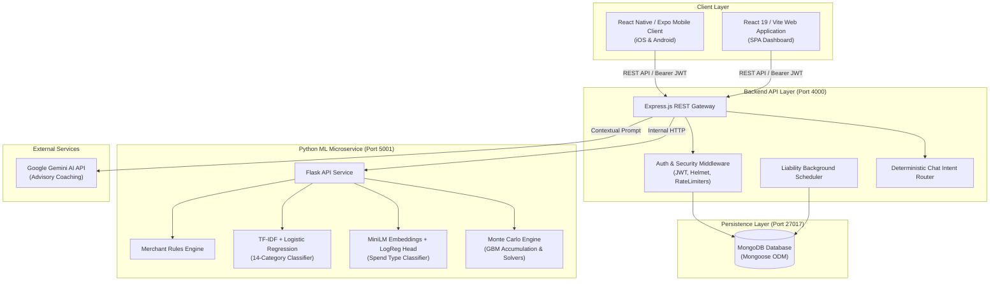
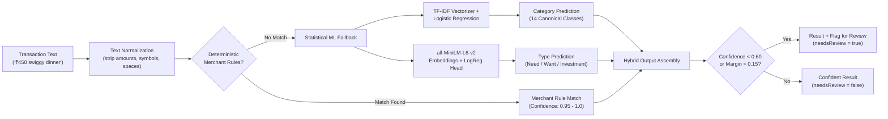

# FINAURA

Adaptive Financial Intelligence System

FINAURA is a personal finance management, financial health evaluation, and stochastic retirement planning platform. It combines automated transaction classification, deterministic behavioral scoring, scenario forecasting, and privacy-preserving household financial intelligence across a React Native mobile client, a React web portal, a Node.js Express API gateway, and a Python Flask machine learning microservice.

Most personal finance tools function as passive digital checkbooks that record past expenses without evaluating sustainability. FINAURA approaches financial management as an integrated lifecycle: incoming transactions are parsed and categorized, current-month behavior is evaluated against goal-oriented savings requirements, and multi-decade wealth paths are projected under stochastic market conditions.

---

## Table of Contents

- [Key Features](#key-features)
- [System Architecture](#system-architecture)
- [Technology Stack](#technology-stack)
- [Machine Learning Pipeline](#machine-learning-pipeline)
- [Research and Benchmarking](#research-and-benchmarking)
- [Repository Structure](#repository-structure)
- [Getting Started](#getting-started)
  - [Prerequisites](#prerequisites)
  - [Installation](#installation)
  - [Environment Configuration](#environment-configuration)
- [Running FINAURA](#running-finaura)
  - [Automated Stack (Recommended)](#automated-stack-recommended)
  - [Manual Startup](#manual-startup)
- [Testing](#testing)
- [Security Architecture](#security-architecture)
- [Privacy Model](#privacy-model)
- [Current Limitations](#current-limitations)
- [Disclaimer](#disclaimer)
- [Contributors](#contributors)
- [License](#license)

---

## Key Features

### Transaction Intelligence
- Full CRUD transaction lifecycle with optimistic client updates.
- Real-time classification through a rules-first hybrid pipeline.
- Dual-dimension tagging: 14 canonical categories and 3 spend types (Need, Want, Investment).
- Confidence evaluation with automatic review flags for low-certainty predictions.
- User overrides for category and type adjustments.

### Financial Maturity Index (FMI)
- Objective financial health score ranging from 0 to 100.
- Computed entirely through deterministic mathematical logic (not an ML model).
- Evaluates current-month behavior across three weighted dimensions:
  - **D1: Saving Discipline (40%):** Actual savings and investment flow compared against the mathematically required monthly contribution to reach retirement goals.
  - **D2: Spending Control (30%):** Non-investment consumption pacing against the user's monthly disposable budget.
  - **D3: Behavioral Stability (30%):** Evaluation of impulse spending, late-night transaction clusters, and discretionary versus essential outflow ratios.
- Core formulation:
  $$\text{FMI} = \text{round}(0.40 \cdot D_1 + 0.30 \cdot D_2 + 0.30 \cdot D_3)$$

### Income Intelligence
- Tracks both declared baseline monthly income and verified deposited income events.
- Income flow smoothing and volatility measurement for variable and gig earnings.
- Built-in 50/30/20 structural cash flow allocation benchmarks.

### Assets and Net Worth
- Categorization across three asset classes: `FIRE_INVESTABLE`, `SEMI_LIQUID`, and `NON_INVESTABLE`.
- Liquidity status tracking (liquid, locked, restricted) and dedicated emergency buffer computation.
- Explicit flags indicating asset inclusion in the retirement wealth corpus.

### Liabilities and Debt Scheduling
- Management of recurring debts, EMIs, and subscriptions.
- Automatic transaction generation on due dates handled by an in-process scheduler.
- Tracking of payment histories, manual payment records, and monthly debt service load.

### FIRE and Retirement Planning
- Financial Independence, Retire Early (FIRE) milestone projections.
- Future Value mathematics solving for required monthly savings.
- Support for three distinct contribution pacing modes:
  - `NOMINAL_FLAT`: Fixed rupee contributions over time.
  - `REAL_CONSTANT`: Contributions that escalate with inflation to preserve purchasing power.
  - `STEP_UP`: Contributions that increase by an annual percentage rate (up to 50% annually).

### Monte Carlo Simulation
- Stochastic wealth accumulation engine that uses 10,000 simulations by default and accepts up to 50,000 per request (minimum 100).
- Modeled via Median-Anchored Geometric Brownian Motion so the median path matches geometric compound expectations.
- Generates probability distributions, funded probabilities, and P10/P25/P50/P75/P90 outcomes.
- Includes a Contribution Solver to determine required monthly savings for target confidence levels and a Funded Age Solver to identify the age at which retirement capital sustains through life expectancy.
- Common Random Numbers (CRN) synchronization across comparative scenarios to reduce estimator variance.

### Predictability and Scenario Analysis
- In-memory scenario engine allowing interactive what-if exploration.
- Zero-persistence execution: users can simulate alternative retirement ages, return expectations, or contribution increases without modifying their stored financial profile.

### Family and Household Intelligence
- Household coordination with an invitation and membership model (owner and members).
- Pooled household analytics tracking combined income, total non-investment spend, and savings rates.
- **Family FMI:** Evaluates pooled household savings flows against pooled required monthly saving rather than computing an arithmetic average of member scores.
- Strict privacy preservation: family membership never merges accounts. Raw transactions, private balances, individual assets, and personal liabilities are never exposed to other family members.
- Note: Family FIRE is intentionally not implemented; retirement milestones remain individual.

### Reports and Analytics
- Monthly review summaries comparing spending pacing, savings performance, and categorical trends.
- Calendar-based heatmaps and spending volatility metrics.
- Client-side and server-side CSV export of transaction history.

### AI Financial Assistant
- Context-aware financial confidant integrated with Google Gemini 1.5 Flash via `@google/generative-ai`.
- Grounded prompt synthesis using verified read-only financial figures; the model is prohibited from recalculating deterministic metrics.
- Deterministic Intent Router (`ChatIntentRouter.js`): intercepts factual financial questions (such as balances, FMI scores, category totals, and debts) and answers directly from database context without invoking external LLMs.
- Graceful degradation: if `GEMINI_API_KEY` is not configured, the deterministic router remains fully operational for factual queries, while advisory prompts return a clear configuration notice.

---

## System Architecture



---

## Technology Stack

| Layer | Technologies |
| :--- | :--- |
| **Mobile Client** | React Native 0.81, Expo SDK 54, React Navigation 6, Zustand, Expo SecureStore |
| **Web Client** | React 19, Vite 8, React Router 7, Recharts 3, Lucide React, TypeScript 6 |
| **Backend API** | Node.js (>= v18), Express 4.22, Mongoose 8.12, Zod 4, Helmet 8, express-rate-limit 8 |
| **Database** | MongoDB 6+ / MongoDB Atlas |
| **ML Microservice** | Python 3.9+, Flask 3.1, Flask-CORS 4.0, NumPy, Pandas, Scikit-Learn |
| **NLP & Embeddings** | `sentence-transformers/all-MiniLM-L6-v2`, Hugging Face Transformers |
| **AI Assistant** | `@google/generative-ai` (Gemini 1.5 Flash), Deterministic Intent Routing |
| **Security** | JSON Web Tokens (HS256), Bcrypt.js (cost 10), SHA-256 token hashing, strict CORS |
| **Testing & Tooling** | Oxlint, TypeScript compiler (`tsc`), custom automated regression and audit suites |

---

## Machine Learning Pipeline

FINAURA employs a rules-first hybrid architecture to classify financial transactions into a canonical 14-category taxonomy and assign spend types (`Need`, `Want`, `Investment`).



### Canonical 14-Category V3 Taxonomy

1. `Food & Dining` (Discretionary / Want)
2. `Groceries` (Essential / Need)
3. `Transport & Travel` (Commute / Discretionary)
4. `Housing` (Essential / Need)
5. `Utilities & Bills` (Essential / Need)
6. `Debt & Loan Payments` (Financial Obligation / Need)
7. `Shopping` (Discretionary / Want)
8. `Entertainment` (Discretionary / Want)
9. `Health` (Essential / Need)
10. `Education` (Personal Capital / Investment)
11. `Personal Care` (Discretionary / Want)
12. `Insurance` (Financial Protection / Need)
13. `Investments` (Wealth Accumulation / Investment)
14. `Misc` (General Baseline / Need)

### Model Architecture and Generalization Performance

The ML pipeline is trained on the production dataset (`ml-service/dataset.csv`, 697 verified samples across all 14 canonical categories).

| Evaluation Suite | Sample Size | Category Accuracy | Macro F1 | Type Accuracy | Review Flag Rate |
| :--- | :--- | :--- | :--- | :--- | :--- |
| **Held-Out Test Set (80/20 Split)** | 140 | 79.29% | 78.54% | N/A (ML Category) | N/A |
| **5-Fold Stratified Cross-Validation** | 697 | 79.48% (+/- 1.21%) | 78.46% (+/- 1.40%) | N/A | N/A |
| **Hybrid Blind Challenge Set** | 68 | 98.5% (67/68) | N/A | 91.2% (62/68) | 35.3% (24/68) |

- **Held-Out Generalization:** 78.54% Macro F1 represents the pure generalization accuracy of the TF-IDF and Logistic Regression model on previously unseen text descriptions.
- **Hybrid Blind Performance:** The 98.5% category accuracy reflects the combined production pipeline (merchant rules resolving 55.9% of queries, and ML classifying the remaining 44.1%).
- **Historical Corpora Separation:** Historical experimental metrics from earlier research phases (such as ~93.4% Macro F1 in Experiment 2) were achieved on an older 9-category synthetic dataset and must not be cited as Production V3 performance.

---

## Research and Benchmarking

The `research/` directory contains reproduction scripts, statistical proofs, and exported experimental artifacts evaluating the mathematical models implemented in FINAURA.

To regenerate all research benchmarks, LaTeX tables, and evaluation figures:

```bash
python3 research/scripts/generate_benchmarks.py
```

### Key Research Findings
1. **Common Random Numbers (CRN) Variance Reduction:** Controlled empirical testing across 30 batches of 2,000 paths demonstrated that synchronizing random variates between baseline and scenario simulations reduced difference-estimator variance by 29.09%.
2. **Family FMI Evaluation:** Family FMI is calculated from pooled household behavior rather than averaging individual FMI scores. For example, in a two-earner household where one member saves aggressively while the other spends heavily, pooled evaluation directly measures aggregate cash flow sustainability.

---

## Repository Structure

```
FINAURA/
├── client/           # React Native / Expo mobile application
├── web/              # React 19 / Vite web client
├── server/           # Node.js Express backend API and schedulers
├── ml-service/       # Python Flask ML microservice (classifiers & Monte Carlo)
├── research/         # Research benchmarks, metrics, datasets, and LaTeX figures
├── scripts/          # Development orchestration and diagnostic shell scripts
├── SECURITY.md       # Security policies, threat boundaries, and audit disclosures
└── README.md         # Authoritative project documentation
```

---

## Getting Started

### Prerequisites

- **Node.js:** v18.0.0 or higher (v20+ recommended)
- **npm:** v9.0.0 or higher
- **Python:** v3.9 or higher (with `pip` and `venv`)
- **MongoDB:** v6.0 or higher running locally on port `27017`, or a remote MongoDB Atlas cluster
- **Mobile Development (Optional):** Expo Go on a physical phone, or Xcode Simulator / Android Studio Emulator

### Installation

Clone the repository:

```bash
git clone https://github.com/parthpalav/LYProj_C34.git
cd LYProj_C34
```

Install dependencies for each service:

```bash
# 1. Server dependencies
cd server && npm install && cd ..

# 2. Web client dependencies
cd web && npm install && cd ..

# 3. Mobile client dependencies
cd client && npm install && cd ..

# 4. Python ML microservice dependencies
cd ml-service
python3 -m venv .venv
source .venv/bin/activate       # On Windows: .venv\Scripts\activate
pip install -r requirements.txt
cd ..
```

---

## Environment Configuration

Copy the template environment files in each service directory:

### 1. Server Configuration (`server/.env`)

Copy `server/.env.example` to `server/.env`.

| Variable | Required | Default / Example | Description |
| :--- | :--- | :--- | :--- |
| `PORT` | No | `4000` | Port for the Express API gateway. |
| `NODE_ENV` | No | `development` | Runtime environment (`development`, `production`, `test`). |
| `MONGO_URI` | Yes (in prod) | `mongodb://127.0.0.1:27017/lyproj` | MongoDB connection URI. Must not be localhost in production. |
| `JWT_SECRET` | **Strictly Yes** | `openssl rand -hex 32` | Secret key for signing HS256 access tokens. Minimum 32 characters. |
| `ALLOWED_ORIGINS` | Yes (in prod) | `http://localhost:5173,http://127.0.0.1:5173` | Allowed browser origins for CORS. |
| `BCRYPT_ROUNDS` | No | `10` | Salt rounds for password hashing. |
| `ML_SERVICE_URL` | No | `http://localhost:5001` | Internal URL for the Python ML microservice. |
| `GEMINI_API_KEY` | No | *None* | Google Gemini API key for contextual coaching. |
| `SMTP_HOST` | No | `smtp.mailtrap.io` | SMTP server for password reset emails. |
| `SMTP_PORT` | No | `587` | SMTP port. |
| `SMTP_USER` | No | *None* | SMTP username. |
| `SMTP_PASS` | No | *None* | SMTP password. |
| `EMAIL_FROM` | No | `"FINAURA Security <no-reply@finaura.app>"` | Sender address for outgoing system emails. |

Generate a compliant JWT secret:
```bash
openssl rand -hex 32
```

### 2. ML Microservice Configuration (`ml-service/.env`)

Copy `ml-service/.env.example` to `ml-service/.env`.

| Variable | Required | Default | Description |
| :--- | :--- | :--- | :--- |
| `FLASK_APP` | No | `api.py` | Flask application entry point. |
| `FLASK_ENV` | No | `development` | Flask runtime mode. |
| `MODEL_BACKEND` | No | `legacy` | Classifier backend (`legacy` for TF-IDF category + MiniLM type). |

### 3. Web Client Configuration (`web/.env`)

Copy `web/.env.example` to `web/.env`.

| Variable | Required | Default | Description |
| :--- | :--- | :--- | :--- |
| `VITE_API_URL` | No | `http://localhost:4000` | Base URL pointing to the Express server. |

### 4. Mobile Client Configuration (`client/.env`)

Copy `client/.env.example` to `client/.env`.

| Variable | Required | Default | Description |
| :--- | :--- | :--- | :--- |
| `EXPO_PUBLIC_API_URL` | No | `http://localhost:4000` | Server URL (set to computer LAN IP when testing on a physical device). |

---

## Running FINAURA

### Automated Stack (Recommended)

FINAURA includes local process orchestration scripts located in `scripts/`:

1. **Pre-flight Diagnostic Check:**
   Validates runtimes, Python packages, port availability, environment secrets, and ML model weights:
   ```bash
   ./scripts/dev-check.sh
   ```

2. **Start Background Stack:**
   Requires MongoDB already running. Launches the ML microservice (port 5001), Express server (port 4000), and Web client (port 5173) in the background with HTTP readiness polling (the mobile client is launched separately when needed):
   ```bash
   ./scripts/dev-start.sh
   ```

3. **Stop Stack:**
   Gracefully shuts down all background processes using recorded process identifiers:
   ```bash
   ./scripts/dev-stop.sh
   ```

Logs are streamed to `.logs/ml-service.log`, `.logs/server.log`, and `.logs/web.log`.

### Manual Startup

If running services in dedicated terminal windows:

#### Terminal 1: Database
Ensure MongoDB is running locally on port 27017:
```bash
mongod --dbpath /data/db
# Or on macOS with Homebrew:
brew services start mongodb-community
```

#### Terminal 2: Python ML Microservice (Port 5001)
```bash
cd ml-service
source .venv/bin/activate
python3 api.py
```

#### Terminal 3: Express Backend API (Port 4000)
```bash
cd server
npm start
```

#### Terminal 4: Web Application (Port 5173)
```bash
cd web
npm run dev
```
Open `http://localhost:5173` in a web browser.

#### Terminal 5: Mobile Client (Port 8081)
```bash
cd client
npm start
```
Press `i` to launch in the iOS Simulator, `a` for the Android Emulator, or scan the QR code with the Expo Go mobile app.

---

## Testing

FINAURA includes comprehensive test suites spanning client UX, backend business logic, security boundaries, and ML correctness.

### Full Stack Orchestration Verification
Runs pre-flight diagnostics, process management checks, authoritative benchmark generation, and scientific invariant validation:
```bash
./scripts/test_phase8_orchestration.sh
```

### Web Application Tests
```bash
# Typecheck TypeScript definitions
npm --prefix web run typecheck

# Lint with Oxlint
npm --prefix web run lint

# End-to-end Family Web workflow test
node web/test_family_web.js
```

### Mobile Application Tests
```bash
# Typecheck TypeScript definitions
npm --prefix client run typecheck

# Verify Password Visibility Toggle UX
node client/test_password_visibility_ux.js

# Verify Family Mobile UX flows
node client/test_family_ux.js
```

### Backend API Tests
```bash
# Security hardening and authentication boundary tests
node server/test_security_hardening.js

# Family system and privacy isolation tests
node server/test_family_system.js

# Liability scheduler and recurring deduction tests
node server/test_liability_feature.js

# Asset CRUD and FIRE classification tests
node server/test_asset_crud.js

# Predictability and Monte Carlo integration tests
node server/test_predictability_foundation.js
```

### Machine Learning Tests
```bash
# Security payload limits and input boundaries
python3 ml-service/test_security_boundaries.py

# Hybrid classifier pipeline test
python3 ml-service/test_hybrid_classifier.py

# Monte Carlo simulation core test
python3 ml-service/test_monte_carlo.py

# Acceptance audit on Production V3 dataset
python3 ml-service/run_v3_acceptance_audit.py
```

---

## Security Architecture

FINAURA implements defense-in-depth principles across its application tiers. For full architecture disclosures, threat boundaries, and audit details, consult [SECURITY.md](SECURITY.md).

- **Authentication:** Short-lived (15-minute) HS256 JWT access tokens paired with rotating, single-use SHA-256 hashed refresh tokens (7-day TTL) stored in MongoDB with automatic reuse detection.
- **Password Security:** Salted and hashed using `bcryptjs` (cost factor 10). Mongoose schemas configure password fields with `select: false`.
- **Account Lockout:** Progressive lockout for 15 minutes after 5 consecutive failed login attempts.
- **HTTP Protection:** Helmet security headers with HSTS enabled in production, strict CORS origin allowlists, and scoped payload limits (4.5 MB for profile avatar uploads, 1 MB for all standard API endpoints).
- **Targeted Rate Limiting:** Separate in-memory rate limiters for authentication, password reset, AI chat, ML classification, and scenario exploration.
- **Multi-Tenant Isolation:** All database queries enforce authorization scoped to the verified `req.user.id` from the decoded JWT token.
- **Log Sanitization:** Sensitive keywords (tokens, passwords, secrets, and API keys) are redacted before output to server logs.

---

## Privacy Model

Household financial coordination introduces complex privacy challenges. FINAURA addresses this through a strict zero-leakage household privacy model:

1. **Independent Accounts:** Joining a Family never merges user accounts or credentials.
2. **Raw Data Isolation:** Family members cannot view each other's individual transaction histories, specific income sources, individual assets, or personal debts.
3. **Pooled Aggregation:** The family dashboard exposes only pooled macro metrics: total household income, total non-investment expenditure, combined savings rates, and Family FMI.
4. **Independent Retirement:** Family FIRE is intentionally not implemented. Retirement projections, target corpus goals, and funded age estimates remain strictly private to each individual user.

---

## Current Limitations

FINAURA is an academic engineering project developed for research and evaluation. The following architectural characteristics should be noted:

- **No Live Banking APIs:** The system relies on manual transaction entry, scheduled liabilities, and simulated import feeds rather than live open-banking integrations (such as Plaid or Account Aggregator networks).
- **Synthetic Training Data:** While based on real-world Indian spending terminology and merchant patterns, the production classification dataset comprises 697 curated samples.
- **Process-Local Rate Limiting:** Rate limiters use in-memory state. A production deployment with horizontal clustering would require a centralized store (such as Redis).
- **Web Token Storage:** The web frontend stores session tokens in browser `sessionStorage` rather than HttpOnly cookies.
- **Informational Projections:** Monte Carlo simulations rely on geometric compounding assumptions and lognormal return distributions; they do not account for extreme macroeconomic regime shifts.

---

## Disclaimer

FINAURA is an educational and research project. All analytics, financial maturity scores, retirement projections, and AI-generated insights are provided solely for informational and demonstration purposes and do not constitute professional financial, investment, accounting, or legal advice.

---

## Contributors

**Project Team (K. J. Somaiya School of Engineering, Somaiya Vidyavihar University):**
- Parth Palav (Roll No: 16010123229)
- Neekunj Zavar (Roll No: 16010123210)
- Rahee Bhoomkar (Roll No: 16010123246)

**Project Guide:**
- Prof. Shweta Dhawan Chachra, Department of Computer Engineering

---

## License

No open-source license is currently provided with this repository. All rights are reserved by the authors. For academic or evaluation inquiries, please contact the project maintainers.
