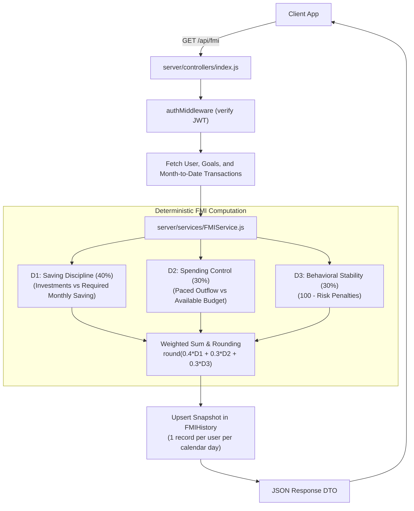

# Financial Maturity Index (FMI) Architecture

## Overview

The Financial Maturity Index (FMI) is an objective, deterministic financial health metric that evaluates a user's current-month personal finance discipline on a scale of 0 to 100. It measures whether current financial behavior aligns with long-term financial stability and retirement readiness.

FMI is computed entirely through deterministic financial logic inside the Express backend ([FMIService.js](../server/services/FMIService.js)).

FMI is explicitly NOT:
- A machine learning or regression model
- An artificial intelligence or LLM-generated score
- A Monte Carlo simulation output
- A credit score or loan underwriting algorithm
- A retirement probability percentage

## Design Goals

1. **Deterministic:** Identical financial profiles and monthly transactions produce identical scores.
2. **Explainable:** Every point gained or deducted is traceable to published mathematical formulas.
3. **Goal-Oriented:** Evaluates performance against individualized retirement savings requirements rather than raw bank balances.
4. **Calendar-Paced:** Evaluates current-month spending pacing dynamically throughout the month.
5. **Separation of Concerns:** Consumes transaction category and type classifications, but does not rely on machine learning for scoring.

## Core Formula

FMI is computed as a weighted sum of three distinct behavioral pillars:

$$\text{FMI} = \text{clamp}\left(\text{round}\left(0.40 \cdot D_1 + 0.30 \cdot D_2 + 0.30 \cdot D_3\right), 0, 100\right)$$

Where:
- **$D_1$ (Saving Discipline, 40% weight):** Measures actual monthly investment flow against the user's required monthly savings target.
- **$D_2$ (Spending Control, 30% weight):** Measures non-investment consumption pacing against the user's available monthly disposable budget.
- **$D_3$ (Behavioral Stability, 30% weight):** Evaluates risk factors including late-night spending, impulse clusters, and discretionary imbalances.

---

## Pillar D1: Saving Discipline (40%)

Pillar $D_1$ measures how well the user fulfills their monthly savings obligation.

### Inputs
- **`totalSaved`:** Sum of transaction amounts in the current calendar month where `type === 'Investment'`.
- **`requiredThisMonth`:** Target savings for the current month:
  $$\text{requiredThisMonth} = \text{requiredMonthlySaving} + \text{previousShortfall}$$
  where:
  $$\text{requiredMonthlySaving} = \frac{\max(0, \text{retirementGoal} - \text{currentBalance})}{\text{monthsLeft}}$$
  $$\text{monthsLeft} = \max(1, \text{retirementAge} - \text{currentAge}) \cdot 12$$

If no explicit retirement goal is configured, the system uses a default target corpus of $20 \times \text{annual income}$ ($\text{monthlyIncome} \cdot 12 \cdot 20$).

### Scoring Logic
When $\text{requiredThisMonth} \le 0$ (goal already met or no target set):
- If $\text{totalSaved} > 0$: Score = 95
- If $\text{totalSaved} = 0$: Score = 75

When $\text{requiredThisMonth} > 0$, the algorithm computes the savings ratio:
$$\text{savingRatio} = \frac{\text{totalSaved}}{\text{requiredThisMonth}}$$

Piecewise evaluation:
1. **$\text{savingRatio} \ge 1.0$ (Target met or exceeded):**
   $$\text{Score} = \text{lerp}\left(\min(\text{savingRatio} - 1, 0.5) \cdot 2, 90, 100\right)$$
   Yields 90 at 100% target up to 100 at 150%+ target.
2. **$0.70 \le \text{savingRatio} < 1.0$ (On pace, slight gap):**
   $$\text{Score} = \text{lerp}\left(\frac{\text{savingRatio} - 0.70}{0.30}, 60, 85\right)$$
   Yields 60 to 85.
3. **$\text{savingRatio} < 0.70$ (Behind target):**
   $$\text{Score} = \text{lerp}\left(\frac{\text{savingRatio}}{0.70}, 20, 60\right)$$
   Yields 20 to 60.

Output is clamped to $[0, 100]$.

---

## Pillar D2: Spending Control (30%)

Pillar $D_2$ measures whether the user's ongoing daily consumption will fit within their available monthly disposable budget.

### Inputs
- **`totalSpent`:** Sum of non-investment transactions in the current calendar month (`type === 'Need'` or `type === 'Want'`).
- **`availableMoney`:** Monthly income remaining after reserving required savings:
  $$\text{availableMoney} = \max(0, \text{monthlyIncome} - \text{requiredThisMonth})$$

### Calendar Pacing Model
$D_2$ does not wait until month-end to evaluate spending. It projects month-end consumption using calendar-aware daily run-rates:
$$\text{avgDailySpend} = \frac{\text{totalSpent}}{\text{daysPassed}}$$
$$\text{predictedMonthlySpend} = \text{avgDailySpend} \cdot \text{daysInMonth}$$

### Scoring Logic
When $\text{availableMoney} \le 0$ (income is fully committed to savings or debt):
- If $\text{totalSpent} = 0$: Score = 80
- If $\text{totalSpent} > 0$:
  $$\text{Score} = \text{clamp}\left(\text{round}\left(40 - \frac{\text{totalSpent}}{\max(1, \text{monthlyIncome})} \cdot 20\right), 0, 100\right)$$

When $\text{availableMoney} > 0$, the algorithm computes the spend ratio:
$$\text{spendRatio} = \frac{\text{predictedMonthlySpend}}{\text{availableMoney}}$$

Piecewise evaluation:
1. **$\text{spendRatio} \le 0.70$ (Well controlled, budget surplus):**
   $$\text{Score} = \text{lerp}\left(1 - \frac{\text{spendRatio}}{0.70}, 80, 100\right)$$
   Yields 80 to 100.
2. **$0.70 < \text{spendRatio} \le 1.0$ (Moderate consumption, within budget):**
   $$\text{Score} = \text{lerp}\left(\frac{1 - \text{spendRatio}}{0.30}, 50, 80\right)$$
   Yields 50 to 80.
3. **$\text{spendRatio} > 1.0$ (Projected overspending):**
   $$\text{Score} = \text{lerp}\left(\max(0, 2 - \text{spendRatio}), 20, 50\right)$$
   Yields 20 to 50, reaching a minimum floor of 20 when projected spending exceeds $2 \times \text{available budget}$.

---

## Pillar D3: Behavioral Stability (30%)

Pillar $D_3$ evaluates transaction patterns for impulsive, volatile, or disproportionate financial behaviors via [BehaviorService.js](../server/services/BehaviorService.js).

### Scoring Logic
$D_3$ starts at a baseline score of 100 points and applies additive penalties for detected risk patterns:

| Behavioral Risk Pattern | Trigger Condition | Point Deduction |
| :--- | :--- | :--- |
| **Late-Night Spending** | Transactions recorded between 11:00 PM and 5:00 AM | -15 |
| **Discretionary Imbalance** | Current-month Wants exceed Needs ($\text{wantsTotal} > \text{needsTotal}$) | -15 |
| **Anomaly Cluster** | Multiple statistically anomalous transaction amounts detected | -10 |
| **Impulse Shopping** | Rapid burst of retail or discretionary shopping purchases | -8 |
| **Food Spending Spike** | Dining and delivery outlays significantly exceeding normal run-rate | -5 |

The final score is clamped:
$$D_3 = \text{clamp}(100 - \sum \text{penalties}, 0, 100)$$

If no risky patterns are detected in current-month activity, $D_3 = 100$.

---

## Evaluation Window

Personal FMI operates strictly on the **current calendar month**:
- Start: First calendar day of the month at 00:00:00 local time.
- End: Last calendar day of the month at 23:59:59 local time.
- Transactions from prior calendar months are excluded from the current FMI calculation.
- On the first day of a new month, FMI resets automatically based on baseline income and zero initial expenses.

---

## Relationship to Transaction Classification

Transaction classification is performed upstream by a hybrid pipeline (deterministic merchant rules + TF-IDF category classifier + MiniLM spend-type classifier).

FMI relies on the resulting transaction `type`:
- `Investment`: Inflow to wealth assets, counted in $D_1$.
- `Need`: Essential consumption, counted in $D_2$ and $D_3$.
- `Want`: Discretionary consumption, counted in $D_2$ and $D_3$.

**Architecture Boundary:** Machine learning assists in categorizing text descriptions, but machine learning plays zero role in the calculation of FMI. If a user manually overrides a transaction type (e.g., reclassifying a purchase from `Want` to `Need`), FMI recalculates deterministically based on the user's manual classification.

---

## Runtime Data Flow



---

## Score Labels

FMI scores map to five qualitative status bands:

| Score Range | Status Label | Qualitative Interpretation |
| :--- | :--- | :--- |
| **80 to 100** | `Excellent` | Optimal savings rate and strict spending control. |
| **65 to 79** | `Good` | On track to hit retirement targets with minor variances. |
| **45 to 64** | `Fair` | Meeting basic obligations but susceptible to budget strain. |
| **25 to 44** | `Needs Attention` | Trailing monthly savings targets or overspending budget. |
| **0 to 24** | `Critical` | Severe budget deficit or critical savings shortfall. |

---

## Worked Example (Illustrative)

Consider an illustrative user profile:
- Monthly income: ₹100,000
- Required monthly retirement saving: ₹20,000
- Available monthly budget: ₹80,000
- Mid-month day 15 of 30:
  - Investments made: ₹20,000 (100% of target) $\rightarrow D_1 = 90$
  - Non-investment spending: ₹34,000 (daily run-rate: ₹2,266.67, projected month-end: ₹68,000, spend ratio: 85%) $\rightarrow D_2 = 65$
  - Behavior: One late-night order (-15 penalty) $\rightarrow D_3 = 85$

Calculation:
$$\text{Raw FMI} = (0.40 \cdot 90) + (0.30 \cdot 65) + (0.30 \cdot 85) = 36.0 + 19.5 + 25.5 = 81.0$$
$$\text{Final FMI} = 81 \quad (\text{Status: } \text{Excellent})$$

---

## API Contract

Endpoint: `GET /api/fmi` (Authenticated via Bearer JWT)

### Response Structure (Excerpt)
```json
{
  "score": 81,
  "FMI": 81,
  "fmiLabel": "Excellent",
  "status": "below",
  "requiredMonthlySaving": 20000,
  "requiredThisMonth": 20000,
  "totalSaved": 20000,
  "totalSpent": 34000,
  "predictedMonthlySpend": 68000,
  "availableMoney": 80000,
  "pillars": {
    "D1_savingDiscipline": { "score": 90, "weight": 0.4, "detail": "Saving 100% of target - excellent" },
    "D2_spendingControl": { "score": 65, "weight": 0.3, "detail": "Predicted spend is 85% of budget - moderate" },
    "D3_behavioralRisk": { "score": 85, "weight": 0.3, "detail": "1 risk factor(s) detected" }
  },
  "insights": [
    "Great discipline! You are on track to save ₹12,000 extra this month",
    "You have met your savings target for this month - keep it up!"
  ],
  "alerts": [],
  "prediction": {
    "daysPassed": 15,
    "daysInMonth": 30,
    "avgDailySpend": 2267,
    "predictedMonthlySpend": 68000
  },
  "goalDetail": {
    "retirementGoal": 2400000,
    "remainingGoal": 2400000,
    "monthsLeft": 120,
    "yearsLeft": 10
  },
  "timestamp": "2026-09-22T00:00:00.000Z"
}
```

---

## Relationship to Other FINAURA Systems

### FMI vs FIRE
- **FMI:** Measures short-term (current-month) behavioral pacing and savings execution.
- **FIRE Planning:** Models multi-decade accumulation milestones, real retirement targets, and withdrawal horizons.
- FMI uses the user's required monthly savings target as an input for $D_1$, but FMI is not a FIRE number and does not predict retirement age.

### FMI vs Predictability & Scenario Analysis
- Predictability evaluates future wealth trajectories across alternative contribution and market return scenarios.
- FMI evaluates present-month discipline. Predictability and scenario simulations do not inject FMI into stochastic return equations.

### FMI vs Monte Carlo Simulation
- Monte Carlo simulation is a stochastic engine modeling probabilistic investment returns across thousands of market paths.
- FMI is completely deterministic. Monte Carlo does not produce FMI, and FMI does not alter simulation shocks.

### Personal FMI vs Family FMI
- **Personal FMI:** Evaluates an individual's private accounts and behaviors ([FMIService.js](../server/services/FMIService.js)).
- **Family FMI:** Evaluates pooled household savings flows against pooled required monthly saving across all family members ([FamilyFMIService.js](../server/services/FamilyFMIService.js)).
- Family FMI is calculated from pooled household cash flows rather than computing an arithmetic average of member scores. Family members cannot inspect each other's individual FMI scores, transactions, or personal retirement goals.

---

## Testing and Characterization

FMI calculations are covered by deterministic characterization test suites:
- [server/test_fmi_characterisation.js](../server/test_fmi_characterisation.js): Validates golden test fixtures across low, target, and surplus savings ratios.
- [server/test_fmi_history_pillars_persistence.js](../server/test_fmi_history_pillars_persistence.js): Verifies daily snapshot upsert semantics and pillar persistence in MongoDB.
- [server/test_fmi_history_idempotency.js](../server/test_fmi_history_idempotency.js): Ensures that multiple calculations within the same calendar day update the same daily snapshot without duplicate records.

---

## Security and Privacy

1. **Authentication:** Access to `GET /api/fmi` requires a verified JSON Web Token (`authMiddleware`).
2. **Tenant Isolation:** All financial metrics are scoped strictly to `req.user.id`.
3. **Server-Side Authority:** All FMI scores, status labels, and pillars are computed authoritatively on the server; clients cannot mutate scores directly.
4. **Data Minimization:** Household endpoints present only aggregated family-level metrics to prevent cross-member financial surveillance.

---

## Historical Note

Earlier prototype iterations explored training a supervised regression model on synthetic financial datasets to predict retirement readiness scores, as well as an initial single-equation future-value gap formula. Both approaches were rejected because supervised models lacked real-world ground truth and introduced label leakage. The current architecture uses the explainable, three-pillar deterministic model documented above.
